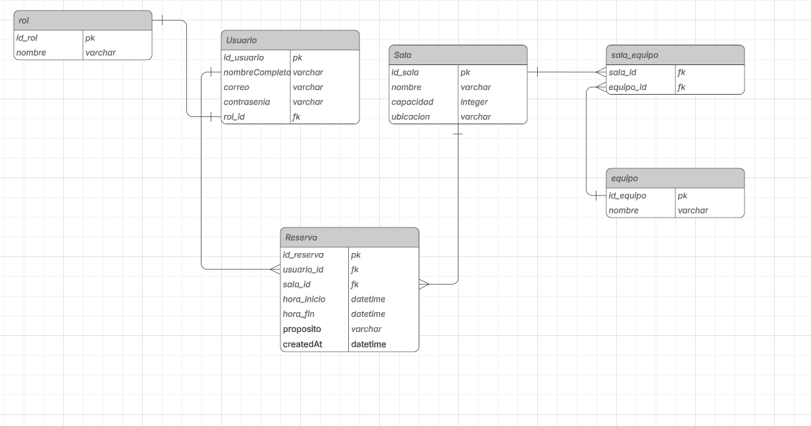

Sistema de Gestión de Reserva de Salas

Este proyecto es una solución Fullstack moderna diseñada para la gestión y reserva de espacios de reunión. Utiliza una arquitectura contenerizada con Docker, lo que garantiza un despliegue rápido y consistente en cualquier sistema operativo.

Tecnologías Utilizadas

    Backend: Java 17, Spring Boot 3, Spring Security (JWT) y Hibernate/JPA.

    Frontend: React 18 (Vite), Tailwind CSS y Lucide Icons.

    Base de Datos: MySQL 8.0.

    Infraestructura: Docker, Docker Compose y Nginx.

Instalación y Despliegue

1. Clonar el repositorio
   Bash -- > git clone https://github.com/MOISES03MM/PruebaTecnica.git
   cd PruebaTecnica

2. Levantar con Docker

Asegúrate de tener Docker Desktop abierto y ejecuta:
Bash -- > docker-compose up --build

Este comando compilara el backend, generará el build del frontend y configurará la red local entre contenedores automáticamente.
📸 Vista Previa y Diagrama

A continuación, se muestra una captura de la interfaz principal y la arquitectura del sistema:

 Configuración de la Base de Datos

    Acceder a MySQL dentro del contenedor:
    Bash -- > docker exec -it reservasalas-db-1 mysql -u admin_reserva -p sistema_reserva
    Contraseña: reserva_pass

Puntos de Acceso (Localhost)

Una vez que los contenedores esten corriendo, copia y pega estas URLs en tu navegador:

    -->  Aplicación Web (Frontend): http://localhost
